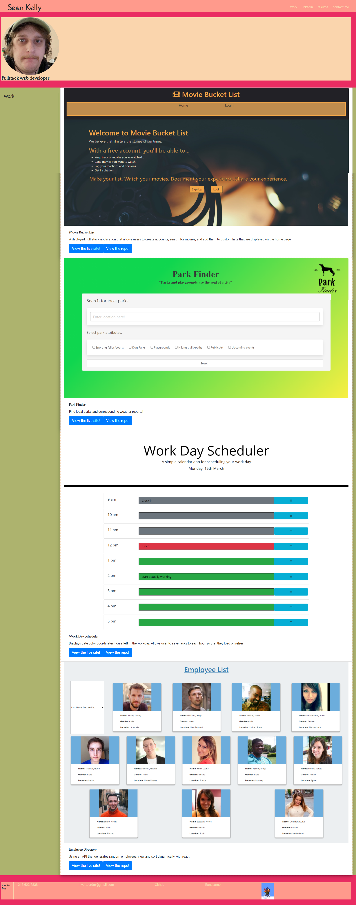

# Revised Portfolio

## Description

Messing with translating html and css pages into simple react apps and using reusable components to make code more dry.

## Installation

Live site at [https://skelly1389.github.io/portfolio-3/](https://skelly1389.github.io/Revised_Portfolio/)

## Usage
Clickable links to my profiles on github and linkedin as well as links to three of the best homeworks and projects I've completed in the course so far.
    :
    
   
## Credits

Used bootstrap for styling, lots of references to their docs and some friendly people's answers on stackoverflow. Also did some basic react formatting and used class activities as inspiration for json arrays as fake endpoints.

## License

Copyright 2021 Sean Kelly

Permission is hereby granted, free of charge, to any person obtaining a copy of this software and associated documentation files (the "Software"), to deal in the Software without restriction, including without limitation the rights to use, copy, modify, merge, publish, distribute, sublicense, and/or sell copies of the Software, and to permit persons to whom the Software is furnished to do so, subject to the following conditions:

The above copyright notice and this permission notice shall be included in all copies or substantial portions of the Software.

THE SOFTWARE IS PROVIDED "AS IS", WITHOUT WARRANTY OF ANY KIND, EXPRESS OR IMPLIED, INCLUDING BUT NOT LIMITED TO THE WARRANTIES OF MERCHANTABILITY, FITNESS FOR A PARTICULAR PURPOSE AND NONINFRINGEMENT. IN NO EVENT SHALL THE AUTHORS OR COPYRIGHT HOLDERS BE LIABLE FOR ANY CLAIM, DAMAGES OR OTHER LIABILITY, WHETHER IN AN ACTION OF CONTRACT, TORT OR OTHERWISE, ARISING FROM, OUT OF OR IN CONNECTION WITH THE SOFTWARE OR THE USE OR OTHER DEALINGS IN THE SOFTWARE.

